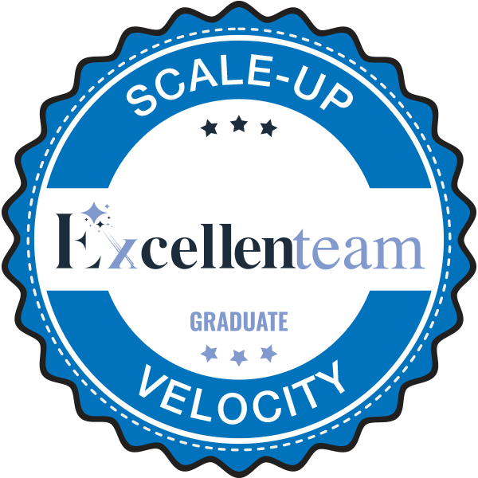
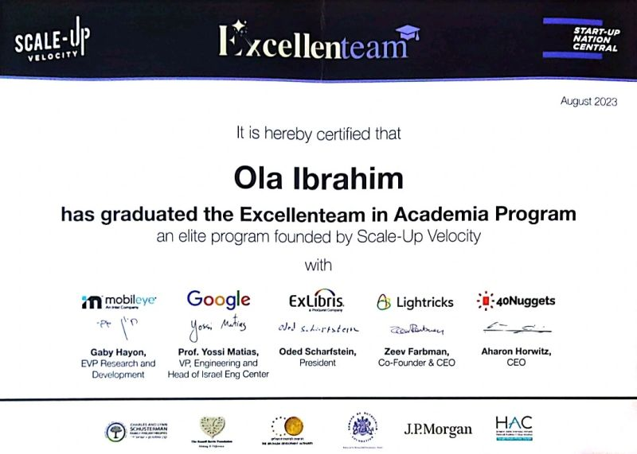

<h1 align="center">👋 Hi there! I'm Ola, a passionate Full Stack Developer dedicated to building web and multi-platform applications.</h1>

  Hello World💜
  

## About Me

Graduated from Hadassah Academic College with a BSc in Computer Science.

- 🌐 **Website:** [Portfolio](https://olaib.github.io/my-portfolio-page/)
- 💼 **LinkedIn:** [Ola Ibrahim](https://www.linkedin.com/in/ola-ibrahim-757504223/)
- 📫 **Email:** olaib76@gmail.com

### Let Me Introduce Myself

#### B.Sc. in Computer Science graduate.

Passionate about **Software Development** and Web Development.

I thrive on **learning new technologies** and use my passion for innovation to drive my work as a developer.

**Highly motivated** software developer. A **team player** with excellent **human skills**, eager to find the next challenge to tackle. I have a passion for learning new technologies and I'm always looking for new opportunities. { **💻** }

I have experience in developing web applications using **React**, **Node.js**, **Java** (Spring + OOP), **Flask** and databases like **MongoDB** and **MySQL** and **SQLite**.

I possess a solid understanding of Object Oriented Programming (OOP), Data Structures and concepts like Design Patterns, SOLID, Clean Code. Additionally, I have a strong command of other programming languages like **C++**, **C**, **Python**.

And I have experience in **CI/CD** and **Docker**.

#### MY PROFESSIONAL TRAINING

  

  

An intensive 5-week all-day bootcamp, post degree, gaining industry-level programming proficiency. High emphasis on clean, elegant, and efficient code, with a deep understanding of software development principles. [Click here to View My Credential](https://www.credly.com/badges/0bcf6727-4934-47b1-836c-32bb02d186c4/linked_in?t=s139f7)

 

⚡ Fun fact: I'm a software, full-stack developer and a fast learner, always eager to dive into new technologies and explore innovative solutions to solve complex problems!

🔭 As a dedicated **Full Stack Developer**, I am continuously expanding my skill set to stay current with the **latest technologies** and industry trends. Currently, I am embarking on a journey to learn **Flutter**, a versatile framework that supports **multi-platform** development, allowing me to create seamless experiences across various devices. Additionally, I am delving into **NestJS**, a progressive Node.js framework, known for its **scalability** and efficiency in building server-side applications. Moreover, I am diving into **Nuxt.js**, a powerful Vue.js framework that enables rapid development of **universal web applications**, offering server-side rendering and static site generation capabilities. Through these endeavors, I aim to enhance my proficiency and deliver cutting-edge solutions to meet the evolving demands of modern software development.

## 🛠️ Technologies & Tools

### **Languages:**

         

### Frontend

   

### Backend

    

### Databases

   

### DevOps

  

### Tools

         

## 📈 GitHub Stats

## 🚀 Projects

some of my projects

## 📫 Contact Me

Feel free to reach out if you want to collaborate on a project, have any questions, or just want to connect.

#### Contact Me **💬**

- **Email:** [olaib76@gmail.com](mailto:olaib76@gmail.com)
- **Phone:** [+972 50 670 5664](tel:+972 50 670 5664)
- **WhatsApp:** [+972 50 670 5664](https://api.whatsapp.com/send?phone=972506705664)
- **LinkedIn:** [LinkedIn](https://www.linkedin.com/in/ola-ibrahim-757504223/)
- **Github:** [Github](https://github.com/olaib)

---

_This README was generated using [readme-typing-svg](https://readme-typing-svg.demolab.com/) and [github-readme-stats](https://github.com/anuraghazra/github-readme-stats)._
